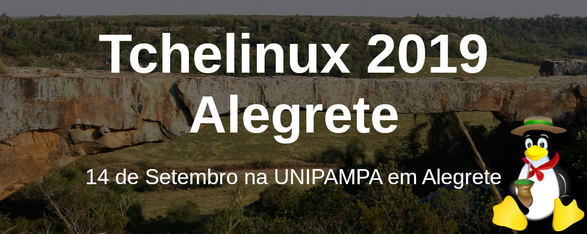
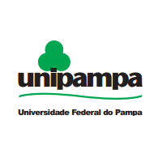

## Sobre

O grupo de usuários de Software Livre Tchelinux, em parceria com a [**Universidade Federal do Pampa Campus Alegrete**](http://novoportal.unipampa.edu.br/alegrete/), tem o prazer de convidar a comunidade para participar do evento que ocorrerá no dia **14 de Setembro de 2019 a partir das 8:30h** na UNIPAMPA em Alegrete.

## Inscrições

O evento tem **entrada franca**, porém os participantes são encorajados a doar 2kg de alimentos não perecíveis (exceto sal), que são doados a instituições de caridade da região.

**Importante:** Os alimentos são recebidos no momento do credenciamento.

<a href="https://alegrete.tchelinux.org/inscricoes/" style="color:#ff4040"><b>Clique aqui e faça sua inscrição!</b></a>

## Certificados

Serão fornecidos certificados digitais para os participantes do evento, que confirmaram sua presença. Para obtê-los, você deverá utilizar o email fornecido na sua inscrição para o evento.

**Importante:** Não esqueça de confirmar sua presença no credenciamento.

## Programação

| 
 Horário 
 | 
 Sala 401 
 | 
 Laboratório de Informática 
 | 
 Sala 403 
 
|:--------------------------:|:-----------------------:|:-----------------------:|:-----------------------:|
| **08:30** <td colspan=4>
**Credenciamento**
 |
| **09:00** <td colspan=4>
**Abertura**  Todo o público  Equipe Tchelinux  
 |
| **09:30** <td colspan=4>
[**Porque e Como Participar de Projetos Open Source**](#Porque_e_Como_Participar_de_Projetos_Open_Source)  Principiante  Julio Biason  
 |
| **10:20** <td colspan=4>
[**(In)Segurança na Internet**](#Insegurança_na_Internet)   Intermediário   Diego Luiz Silva da Costa |
| **11:10** <td colspan=4>
[**Bem vindo ao mundo dos Contêineres**](#Bem_vindo_ao_mundo_dos_Contêineres)   Principiante   Tonin Bolzan |
| **12:00** <td colspan=4>
**Intervalo para Almoço**
 |
| **13:30** | [**Porque Você Deve Aprender Rust **](#Porque_Você_Deve_Aprender_Rust)   Principiante   Julio Biason | [**Case de Gestão Administrativa e Modularizada com uso do GLPI**](#Case_de_Gestão_Administrativa_e_Modularizada_com_uso_do_GLPI)   Principiante   Ricardo Lazzari da Rosa | [**Cases Empresariais**](#Cases_Empresariais)   Principiante   Cases Empresariais sobre Software Livre   |
| **14:20** | [**Teste de Software em Aplicações Mobile**](#Teste_de_Software_em_Aplicações_Mobile)   Intermediário   Luana de Freitas | [**Produzindo vídeos com Software Livre (e sem pirataria!)**](#Produzindo_vídeos_com_Software_Livre_e_sem_pirataria!)   Principiante   Yucatan "Kenjiro" Costa  | [**Cases Empresariais**](#Cases_Empresariais)   Principiante   Cases Empresariais sobre Software Livre   | 
| **15:10** <td colspan=4>
**Coffee-Break**
 |
| **15:40** | [**Desenvolvimento Mobile: Introdução ao Flutter**](#Desenvolvimento_Mobile:_Introdução_ao_Flutter)   Principiante    Márcio Fiorenza e Mauro Oviedo II | [**Explorando dados abertos com Jupyter Notebook**](#Explorando_dados_abertos_com_Jupyter_Notebook)   Principiante    Andrius Antunes Jaques | [**Cases Empresariais**](#Cases_Empresariais)   Principiante   Cases Empresariais sobre Software Livre   |
| **16:30** | [**Git em projetos acadêmicos**](#Git_em_projetos_acadêmicos)   Principiante   Sandro Custódio |[**Gerenciamento de backups com Bacula: Case da UNIPAMPA**](#Gerenciamento_de_backups_com_Bacula:_Case_da_UNIPAMPA)   Principiante   Maurício Martinuzzi Fiorenza | [**Cases Empresariais**](#Cases_Empresariais)   Principiante   Cases Empresariais sobre Software Livre   |
| **17:20** <td colspan=4>
**Encerramento**  Todo o público     Equipe Tchelinux    
 |

## Palestras 

### Porque e Como Participar de Projetos Open Source

No mundo atual, todos usam pelo menos um aplicativo open source. Mas como participar disso? Como ajudar o aplicativo a melhorar? É preciso saber programar para ajudar? Essas e outras perguntas serão respondidas nessa apresentação.

### Julio Biason

[Julio Biason](https://functional.cafe/@juliobiason) participa de projetos open source desde 1990.

### Insegurança na Internet

Estamos conectados cada vez mais, mas será que manter o padrão nos deixa seguros na internet? .... Nesta palestra, que foi tema que ministrei no 1º Simpósio Regional de Segurança Cibernética, realizado pela Marinha do Brasil. Irei de maneira simples comentar sobre os aspectos relacionados a nossa segurança digital em um mundo pós Edward Snowden.

### Diego Luiz Silva da Costa

[Diego Luiz Silva da Costa](https://wiki.projetoroot.com.br/) é o idealizador e mantenedor do Canal no YouTube Projeto Root, que nasceu, em maio de 2014, a partir de uma ideia sua ainda na graduação em Redes de Computadores, na Faculdade de Tecnologia SENAC Pelotas. O canal tem como propósito o ensino gratuito sobre Tecnologia, Software Livre, GNU-Linux, Redes de Computadores e Segurança da Informação.

### Bem vindo ao mundo dos Contêineres

Uma introdução ao mundo DevOps apresentando o que são contêineres e como eles podem ajudar o dia a dia, desde o desenvolvimento até a entrega final de um projeto.

### Tonin de Rosso Bolzan

[Tonin Bolzan](https://bolzan.io) é membro ativo da comunidade FOSS, sendo organizador de vários eventos incluindo o TcheLinux Santa Maria. Trabalho como CTO na umanotec.com e sou apaixonado por programação desde 2007, atualmente trabalho com Sistemas Web utilizando tecnologias como Linux, Docker, PHP, Go, Flutter e Java.

### Porque Você Deve Aprender Rust 

Rust (a linguagem, não o jogo) é uma linguagem que produz código em que a memória é protegida. Trazendo muitas das funcionalidades de linguagens funcionais, com abstrações de alto nível e performance semelhante a C, Rust é uma linguagem que você realmente deve aprender.

### Julio Biason

[Julio Biason](https://functional.cafe/@juliobiason) é programador desde os 12 anos e já conheceu várias linguagens, mas nenhuma que fosse tão interessante quanto Rust.

### Case de Gestão Administrativa e Modularizada com uso do GLPI

Esta apresentação descreve a implantação da ferramenta GLPI na UNIPAMPA através da modularização estruturada e organizada hierarquicamente para atender a gestão administrativa e institucional de chamados, sendo denominada de GAUCHA. A aplicação foi adequada de acordo com a demanda de serviços e recursos vinculados, e é decorrência de uma gestão focada em níveis de atendimento, automação de requisições, fluxo definido de aprovações, gestão de projetos e da possibilidade de integração com serviços externos (fornecedores). Os resultados são discriminados com o feedback dos usuários, considerando a pesquisa de satisfação e a gestão de relatórios com uso de dados gráficos, como no caso das métricas do sistema.

### Ricardo Lazzari da Rosa

[Ricardo Lazzari da Rosa](https://www.linkedin.com/in/ricardolazzaridarosa/) possui graduação em Ciência da Computação (Comparação entre as Metodologias de Alinhamento de DNA) pelo Centro Universitário Franciscano (2008). Possui especialização em Engenharia de Sistemas (Altiris Deployment Solution: Solução para Automação e Manutenção de Redes de Computadores) pela Escola Superior Aberta do Brasil (2011). Atualmente é Analista de Tecnologia da Informação da Universidade Federal do Pampa (UNIPAMPA), onde atuou como coordenador (2017-2018) da Coordenação de Redes, Infraestrutura e Suporte (CORIS) da Diretoria de Tecnologia da Informação e Comunicação (DTIC). Tem experiência na área de Ciência da Computação, com ênfase em Ciência da Computação.

### Teste de Software em Aplicações Mobile

Ao final dessa palestra o ouvinte será capaz de iniciar o desenvolvimento de um aplicativo e estudar teste de software utilizando uma técnica de provisionamento utilizando o Vagrant.

### Luana de Freitas

[Luana de Freitas](https://br.linkedin.com/in/luanadfreitas) é ouvinte de alguns Podcasts de tecnologia e fã de Star Trek, tropeçou no software livre há mais de 10 anos e desde então tenta contribuir para disseminar a palavra do GNU por aí. Formada em Engenharia de Computação em 2013 trabalha atualmente com teste de software web e mobile.

### Produzindo vídeos com Software Livre e sem pirataria!

O intuito da palestra é mostrar que é possível produzir vídeos sem gastar mais de R$ 8.000,00 e sem apelar para pirataria, tudo graças ao Software Livre!

### Yucatan "Kenjiro" Costa

[Yucatan "Kenjiro" Costa](https://www.facebook.com/TheZueraTV) é Graduado e Especializado em Ciência da Computação. Usuário de Linux desde 1997, foi empacotador do KDE para a distribuição Bluewhite64 e criador e mantenedor do script de compilação e empacotamento do Chrome para Slackware Linux.

### Desenvolvimento Mobile: Introdução ao Flutter

Será falado um pouco sobre a história do Flutter e do Dart, porque eles foram criados, como está o desenvolvimento atualmente, e quais as intenções para o futuro da linguagem. Também falaremos sobre como desenvolver em Flutter, boas práticas, arquiteturas para os APPs e algumas vantagens em relação aos concorrentes.

### Márcio Fiorenza

[Márcio Fiorenza](https://www.facebook.com/marcio.fiorenza) trabalha na empresa Umano Tecnologia em Saúde. Desenvolvedor Web Full Stack, trabalhando diariamente com PHP, JS, CSS, HTML e banco de dados MariaDB. Entusiasta de Flutter nas horas livres, atualmente desenvolvendo um aplicativo para empresa que trabalha.

### Mauro Oviedo II

[Mauro Oviedo II](https://www.facebook.com/mauro.oviedoii) trabalha na empresa Umano Tecnologia em Saúde. Desenvolvedor Mobile Full Stack, trabalhando diariamente com Java, Firebase (realtime database e authentication). Entusiasta de Flutter e Kotlin nas horas vagas.

### Explorando dados abertos com Jupyter Notebook

Uma breve apresentação do pacote anaconda, com as atuais ferramentas  opensource mais utilizadas para análise de dados, utilizando a linguagem python. Nesta palestra, serão apresentados cenários construídos a partir de base de dados abertos com a ferramenta Jupyter Notebook, apresentando as principais bibliotecas para analise de dados. Os cenários apresentados, terão como base de dados o portal da transparência do estado do Rio Grande do Sul. Ao final, será feita uma abordagem do caminho a ser trilhado por quem tem interesse em ingressar na área de análise de dados e o próximo passo, que é a ciência de dados.

### Andrius Antunes Jaques

[Andrius Antunes Jaques](https://www.linkedin.com/in/andriusjaques/) é formado em Sistemas de Informação pela Universidade da Região da Campanha, Especialista em Análise de dados e Machine Learning na Analisar.net, atualmente trabalha no desenvolvimento de soluções para análise de dados e machine learning, buscando melhorar processos de gestão empresarial, através da análise de dados.

### Git em projetos acadêmicos

Git em projetos acadêmicos, como num TCC onde um pequeno grupo desenvolve em conjunto. O Git é "A" ferramenta de versionamento e software criada por Linus Torvalds e que dominou o mercado atual. É não apenas gratuíta, é mais que isso, é um Software Livre, de ampla utilização e altamente reconhecido. Até os serviços web que suportam o Git são bons e gratuitos nestes casos.

### Sandro Custódio

[Sandro Custódio](https://www.linkedin.com/in/sandro-custodio/) é Servidor Público da Justiça Federal com mais de 20 anos de TI, foco no Suporte a usuários, pitadas de infra e mais recentemente retornando ao desenvolvimento. Seu primeiro contato com Linux foi em 2003, e desde 2012 usa apenas Linux em casa. Já administrou UNIX e nos dias de hoje utiliza Ubuntu, Mint e CentOS. Tem como hobbies: Moto viagens, fotografia e astronomia. 

### Gerenciamento de backups com Bacula: Case da UNIPAMPA

Na palestra será apresentado o case de utilização do Bacula como software de gerenciamento de backups na UNIPAMPA. Serão apresentados dados da utilização, bem como as configurações e modelos de storages utilizados. Por fim serão apresentados  os projetos futuros, que envolvem a utilização de novos recursos e a integração com XenServer para backup de snapshots.

### Maurício Martinuzzi Fiorenza

[Maurício Fiorenza](https://www.facebook.com/maufiorenza) possui graduação em Ciência da Computação pela Universidade Regional Integrada (URI). Atualmente, é analista de TI e aluno do Mestrado Profissional em Engenharia de Software da UNIPAMPA. Tem experiência e atua em nas áreas de Segurança da Informação e Redes.

### Cases Empresariais

Espaço dedicado a apresentação de cases empresariais utilizando Software Livre em Alegrete e na Região.

## Local

> **UNIPAMPA Campus Alegrete**
> Av Tiaraju, 810
> Ibirapuitã
> Alegrete, RS

   <iframe src="https://www.google.com/maps/embed?pb=!1m14!1m8!1m3!1d27701.543858809786!2d-55.80258595263671!3d-29.786517917996527!3m2!1i1024!2i768!4f13.1!3m3!1m2!1s0x0%3A0xba478dd53e4e9407!2sUNIPAMPA!5e0!3m2!1sen!2sbr!4v1562730702704!5m2!1sen!2sbr" width="600" height="480" frameborder="0" style="border:0" allowfullscreen></iframe>

## Apoio

### Institucional

### Divulgação

